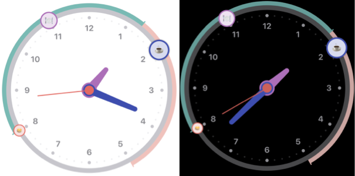

# DaisyUIComponents
This package contains SwiftUI components that's deemed interesing enough for other to use.


## Clock
    

Besides the actual clock the component also has support for time-relative items and a start/end of day timeline indicator. Most properties are customizalble, such as colors, images, what to show and what not to.

Theres also a linear representation of the same information called `HorizontalTimeLineView`.

```swift
struct MyView: view {
    let model = ClockViewModel.dummyModel
    var body:some View {
        VStack {
            ClockView(model).frame(maxWidth: .infinity,maxHeight: .infinity) { itemTapped in
                // choose what to do with the user intearction 
            }
            HorizontalTimeLineView(model) { itemTapped in
                // choose what to do with the user intearction 
            }
        }
    }
}
```

## TODO

- [x] code-documentation
- [ ] write tests
- [x] complete package documentation

